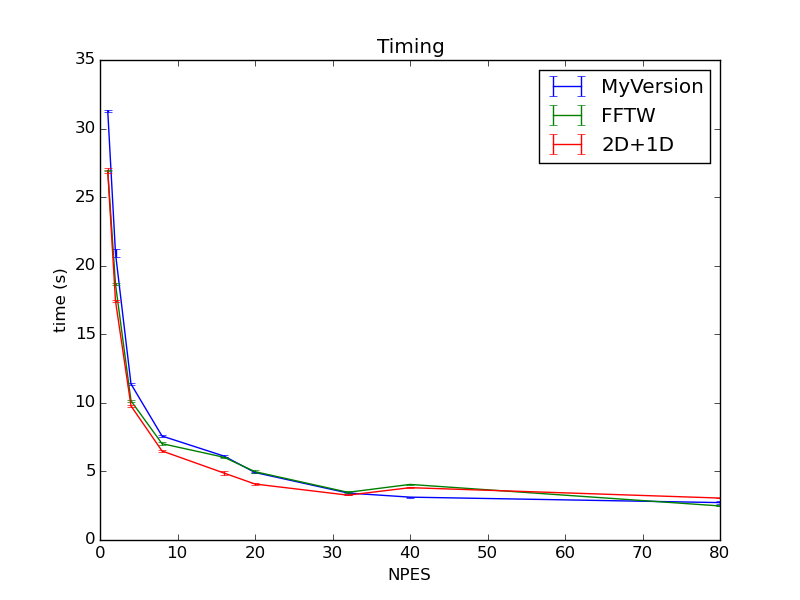
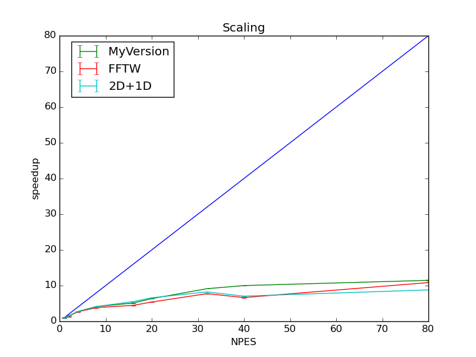

==================
Results
==================

Here I report the timing and the scaling obtained comparing the 3D Fast Fourier Transform (FFT) calculation
with the fftw library and my versions. The "pdicerbo-P2.7/D2-exercise2/provided_code/C/fft_wrapper.c" file
contains two implementations of the function that performs the FFT. The "old_fft_3d" function performs the
FFT through the calculation of three 1D FFT (one for each dimension), while "fft_3d" comes to the result
performing first a 2D FFT and then performing a 1D FFT on the remaining dimension. Because of the algorithms
we expect better results with fft_3d (that need less copies).

In the following plot the label "MyVersion" refers to data obtained with the "old_fft_3d" function while
the label "2D+1D" refers to data obtained with the "fft_3d" function.

Plots
==================

These behaviours are obtained with a matrix with size 480x480x96 and performing only 2 steps of integration.

Here the scaling obtained:
	   

